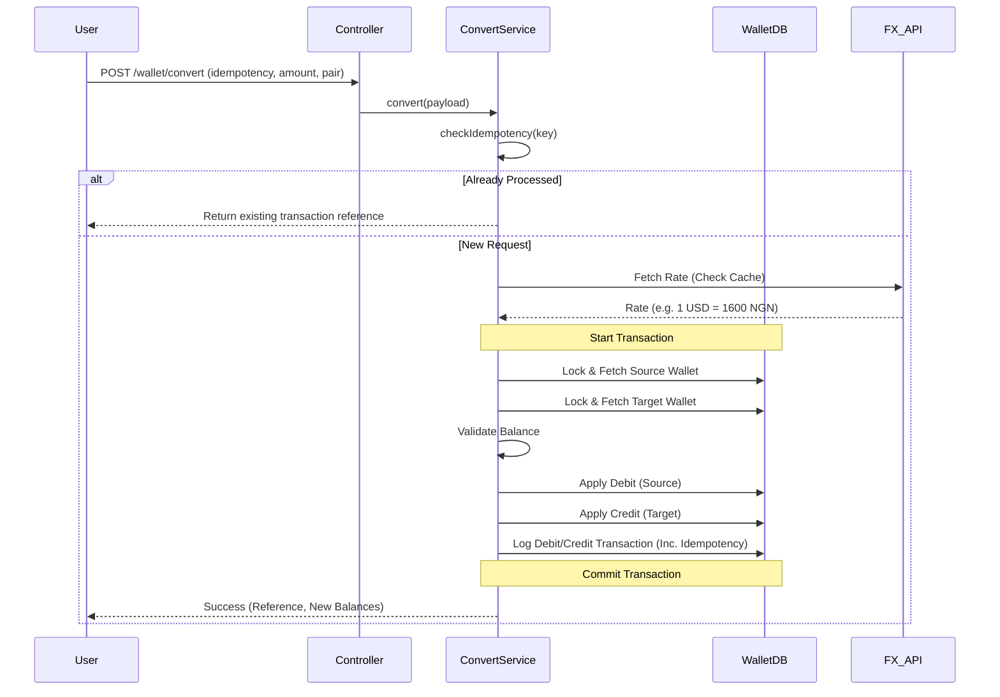

# CredPal Multi-Currency Wallet System

A robust NestJS-based backend system for managing multi-currency wallets, enabling currency conversion, and trading between supported currency pairs (NGN, USD, EUR, GBP).

## 🚀 Features

- **Multi-Currency Support**: Separate balances for NGN, USD, EUR, and GBP.
- **Atomic Transactions**: Ensures data consistency using database-level pessimistic locking.
- **Idempotency**: Prevents duplicate processing of funding, conversion, and trade requests.
- **FX Rate Management**: Real-time rates from external APIs with caching and stale-fallback resilience.
- **Dynamic Wallet Creation**: Wallets are automatically initialized upon first access or funding.
- **Transaction History**: Comprehensive logging of all debits and credits with detailed metadata.

---

## 🏗️ Architecture & Design Decisions

### 1. Database Modeling

- **PostgreSQL**: Chosen for its robust ACID compliance and support for JSONB (used for transaction metadata).
- **Wallet Per Currency**: Instead of a single row with multiple columns, each user-currency pair is a separate row. This allows effortless expansion to new currencies (Scalability).

### 2. Concurrency & Safety

- **Pessimistic Locking**: Every financial operation uses `pessimistic_write` locks. When a conversion starts, both source and target wallets are locked at the DB level, preventing race conditions or double-spending.
- **Atomicity**: All multi-step operations (e.g., Trading: Debit A -> Credit B -> Log Transaction) are wrapped in TypeORM managed transactions.

### 3. Resilience (External API)

- **Layered Caching**: FX rates are cached for 1 hour.
- **Retry Mechanism**: Transient network failures are handled via retries in the `AxiosService`.
- **Stale Fallback**: If the external API is completely down, the system falls back to the last known-good cached rate, ensuring the service remains available.

### 4. Idempotency

- All write operations require an `idempotency` key (UUID). The system checks for existing transaction records with that key before execution, ensuring that network retries or double-clicks don't result in duplicate charges.

---

## 📊 Flow Diagrams

### Currency Trade/Conversion Flow



---

## 🛠️ Setup Instructions

### Prerequisites

- Node.js (v18+)
- PostgreSQL
- npm or yarn

### Installation

1.  Clone the repository:
    ```bash
    git clone <repository-url>
    cd credpal
    ```
2.  Install dependencies:
    ```bash
    npm install
    ```
3.  Configure environment variables:
    Create a `.env` file in the root directory and add the following:
    ```env
    FIAT_API_KEY=your_exchange_rate_api_key
    DB_TYPE=postgres
    DB_HOST=localhost
    DB_PORT=5432
    DB_USER=your_user
    DB_PASS=your_password
    DB_NAME=credpal_db
    JWT_SECRET=your_secret_key
    NODE_ENV=development
    MAIL_USER=your_email
    MAIL_PASS=your_password
    MAIL_HOST=your_mail_host
    MAIL_PORT=your_mail_port
    ```

### Running the App

```bash
# Development mode
npm run start:dev

# Production mode
npm run build
npm run start:prod
```

---

## 📖 API Documentation

The API is fully documented using Swagger Open API.

The OpenAPI spec is also available as a JSON file in the root directory (/swagger-spec.json) for import into Postman or Insomnia.

- **Development Docs**: [http://localhost:3000/docs](http://localhost:3000/docs)
- **Static Spec**: [http://localhost:3000/swagger-spec.json](http://localhost:3000/swagger-spec.json)

### Key Endpoints:

- `GET /wallet/transactions`: Retrieve paginated transaction history.
- `GET /wallet/:currency`: Get balance for a specific currency (auto-creates if missing).
- `POST /wallet/fund`: Fund a wallet using a specific currency and idempotency key.
- `POST /wallet/convert`: Convert between currencies (Sell Source Amount).
- `POST /wallet/trade`: Trade currencies (Buy Target Amount).
- `GET /wallet/fx-rates/:currency`: Get current FX rates relative to the base currency.

---

## 📈 Scaling for Millions of Users

To handle millions of users and high transaction volumes, the following strategies would be employed:

1.  **Database Partitioning**: The `transactions` table will grow the fastest. We would implement **horizontal partitioning (Sharding)** based on `userId` or use **TimescaleDB** (PostgreSQL extension) for efficient time-series transaction logging.
2.  **Read/Write Splitting**: Implement a Primary-Replica architecture where write operations (funding, converting) hit the primary, while history queries (transactions) are served by read-only replicas.
3.  **Distributed Caching**: Transition from in-memory caching to a distributed **Redis** cluster for FX rates and idempotency keys to ensure consistency across multiple API instances.
4.  **Message Queues**: For non-blocking tasks (like sending email receipts or updating analytics), move them to background workers using **RabbitMQ** or **BullMQ** to keep the core wallet transaction loop as fast as possible.
5.  **Optimistic vs. Pessimistic Locking**: While pessimistic locking is used now for safety, under massive multi-user load, we could move to **Optimistic Locking** with a `version` column to reduce DB connection wait times.

---

## 📝 Key Assumptions

1.  **Fixed Rates**: FX rates are assumed to be "frozen" at the moment the transaction starts based on the latest fetch.
2.  **Zero-Fee Exchange**: Mid-market rates are used directly; no spread or commission is currently applied.
3.  **Infinite liquidity**: The system acts as the counterparty for all conversions, assuming the platform always has enough reserves to settle.
4.  **Auth Integration**: The system assumes an `AuthUser` is available via `@SessionUser()` and that the user's `NGN` wallet is the primary funding source.
5.  **Initial Balance**: New wallets created dynamically start with a balance of `0`.
6.  **Accuracy**: `big.js` is used for all calculations to avoid floating-point errors (e.g., `0.1 + 0.2 !== 0.3`).
# credpal
